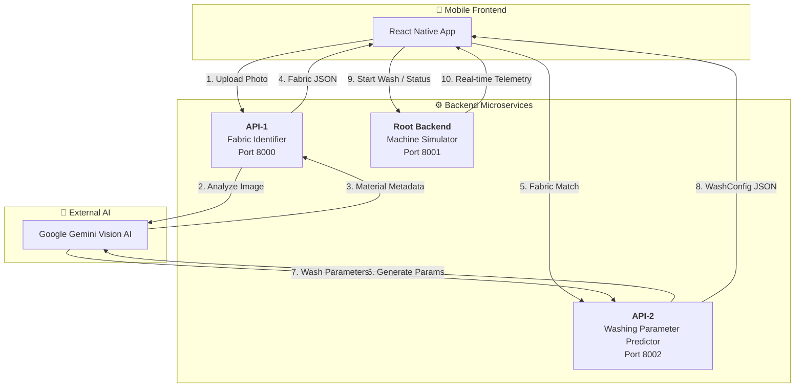

# 🧺 Smart Washer: AI-Powered Laundry System

[](https://fastapi.tiangolo.com/)
[](https://reactnative.dev/)
[](https://ai.google.dev/)
[](https://tailwindcss.com/)

An advanced, multi-service IoT washing machine simulator that leverages **Computer Vision** and **Generative AI** to analyze fabrics and autonomously predict optimal washing parameters.

---

## ✨ Key Features

- **🧠 AI Fabric Analysis**: Upload clothing photos and get instant identification of material (Cotton, Silk, Denim, etc.), fiber category, and dirt levels.
- **⚙️ Predictive Wash Cycles**: Seamlessly calculates temperature, spin speed, detergent volume, and duration based on detected fabric properties.
- **⏱️ Live Countdown Timer**: High-precision 1-second ticking countdown on both the Dashboard and Wash Progress screens.
- **🔋 Real-time IoT Simulation**: A dedicated Python backend simulating water usage, load weight, and machine stages (Washing, Rinsing, Spinning).
- **🔔 Smart Notifications**: Context-aware alerts for cycle completion, system maintenance, and AI insights.

---

## 🏗️ System Architecture

The project is built on a distributed microservices architecture consisting of three specialized Python backends and a React Native frontend.



### 📡 Port Mapping

| Service | Port | Responsibility |
| :--- | :--- | :--- |
| **API-1** | `8000` | Image processing & Fabric type detection |
| **Root Backend** | `8001` | Machine state, simulation, and history |
| **API-2** | `8002` | Logic generation for washing parameters |
| **Metro Packager** | `8081` | Frontend hot-reloading & bundling |

---

## 🛠️ Technology Stack

- **Frontend**: React Native, Expo, TypeScript, Tailwind CSS (NativeWind), Lucide Icons.
- **Backend**: Python 3, FastAPI, Uvicorn, Pydantic.
- **AI/ML**: Google Gemini Pro & Vision API (`google-generativeai`).
- **DevTools**: Git, Bash, asyncio.

---

## 🚀 Getting Started

### 1. Prerequisites
- Node.js (v18+)
- Python (v3.10+)
- Google Gemini API Key

### 2. Environment Setup
Create a `.env` file in both `backend/api1/` and `backend/api2/`:
```bash
GEMINI_API_KEY=your_api_key_here
```

### 3. Start Backend Services
Run each of these in a separate terminal window:

```bash
# API-1
cd backend/api1 && uvicorn main:app --port 8000

# Root Backend
cd backend && uvicorn main:app --port 8001

# API-2
cd backend/api2 && uvicorn main:app --port 8002
```

### 4. Run Frontend
```bash
cd frontend
npm install
npx expo start --ios
```

---

## 📸 User Journey

1. **Dashboard**: View your current machine status and latest alerts.
2. **Analysis**: Click **"Analyze Fabric"** and upload 1-5 photos of your laundry.
3. **AI Logic**: Watch API-1 identify your materials and sync them to the UI.
4. **Parameter Match**: Predict the ideal wash settings (Temp, Spin, Duration) automatically.
5. **Wash Phase**: Start the wash and monitor the **Live Countdown Timer** as it simulates a real-world cycle.

---

## 📄 License
This project is for demonstration and research purposes.

---
*Created with ❤️ for Smart Home Automation*
